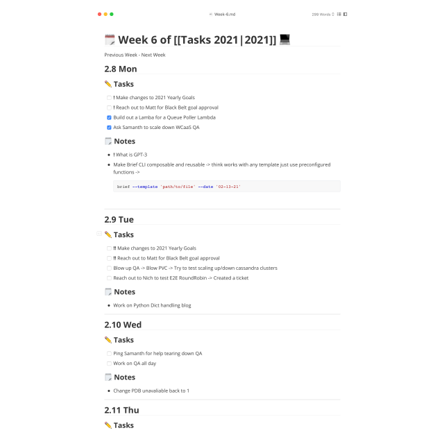

# Brief CLI

Generates a customizable weekly report to track and log daily activities and tasks.



## Usage

Generate a weekly report using the default template

```
brief create
```

Use a custom template:

```
brief create --template /path/to/template
```

Edit the saved template:

```
brief edit
```

Restore the default template:

```
brief restore
```


